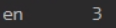
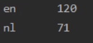

# Opdracht: Letterfrequenties
> Recognize Whether De Sentence Is English Or Dutch With An Accuracy Score Of At Least 90%

## Usage Command

OS X & Linux:

```sh
cat testtext.txt | hadopy --mapper "python mapper.py" --reducer "python reducer1.py" | hadopy --mapper "python mapper2.py" --reducer "python reducer2.py"
```

Windows:

```sh
type sentences.nl-en.txt | hadopy --mapper "python mapper.py" --reducer "python reducer.py" | hadopy --mapper "python mapper2.py" --reducer "python reducer2.
py"
```

## Usage example
To use it:
- Download the entire code as ZIP or clone it
- Put your text file in it (I use [test.txt](https://github.com/GameModes/DIP/blob/main/Opdracht2/test.txt))
- Use the Usage command with the your used OS system
  
This will give the amount of counted English and Dutch Sentences  
Since my test files was containing only english sentences this would be output:  


To really test out the code, lets use a bigger Text file.
[This Text File](https://github.com/GameModes/DIP/blob/main/Opdracht2/sentences.nl-en.txt) contains 73 Dutch and 119 Engels Sentences.
Running this will give the following output:  


_For more examples and usage, please refer to the [Wiki][wiki]._

## Library Install

Describe how to install all the Libraries

OS X & Linux:
```sh
pip install sys
pip install hadopy
```

Windows:
```sh
pip3 install sys
pip3 install hadopy
```

## Code Buddy
Quinn de Groot:
[https://github.com/DragonKiller952](github)


<!-- Markdown link & img dfn's -->
[npm-image]: https://img.shields.io/npm/v/datadog-metrics.svg?style=flat-square
[npm-url]: https://npmjs.org/package/datadog-metrics
[npm-downloads]: https://img.shields.io/npm/dm/datadog-metrics.svg?style=flat-square
[travis-image]: https://img.shields.io/travis/dbader/node-datadog-metrics/master.svg?style=flat-square
[travis-url]: https://travis-ci.org/dbader/node-datadog-metrics
[wiki]: https://github.com/yourname/yourproject/wiki
